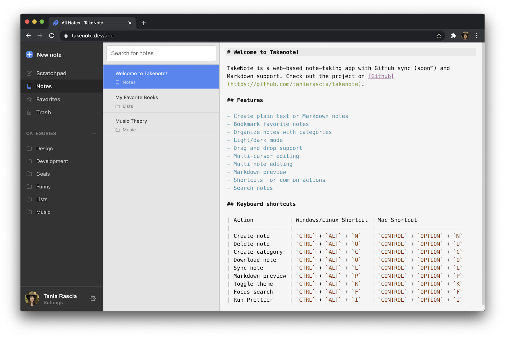

  

 
   
   
 

 

   
   
   
   

A web-based notes app for developers. (Demo only)

## Features

- **Plain text notes** - take notes in an IDE-like environment that makes no assumptions
- **Markdown preview** - view rendered HTML
- **Linked notes** - use `{{uuid}}` syntax to link to notes within other notes
- **Syntax highlighting** - light and dark mode available (based on the beautiful [New Moon theme](https://taniarascia.github.io/new-moon/))
- **Keyboard shortcuts** - use the keyboard for all common tasks - creating notes and categories, toggling settings, and other options
- **Drag and drop** - drag a note or multiple notes to categories, favorites, or trash
- **Multi-cursor editing** - supports multiple cursors and other [Codemirror](https://codemirror.net/) options
- **Search notes** - easily search all notes, or notes within a category
- **Prettify notes** - use Prettier on the fly for your Markdown
- **No WYSIWYG** - made for developers, by developers
- **No database** - notes are only stored in the browser's local storage and are available for download and export to you alone
- **No tracking or analytics** - 'nuff said
- **GitHub integration** - self-hosted option is available for auto-syncing to a GitHub repository (not available in the demo)

## About

TakeNote is a note-taking app for the web. You can use the demo app at [takenote.dev](https://takenote.dev). It is a static site without a database and does not sync your notes to the cloud. The notes are persisted temporarily in local storage, but you can download all notes in markdown format as a zip.

TakeNote was created with TypeScript, React, Redux, Node, Express, Codemirror, Webpack, Jest, Cypress, Feather Icons, ESLint, and Mousetrap, among other awesome open-source software.

